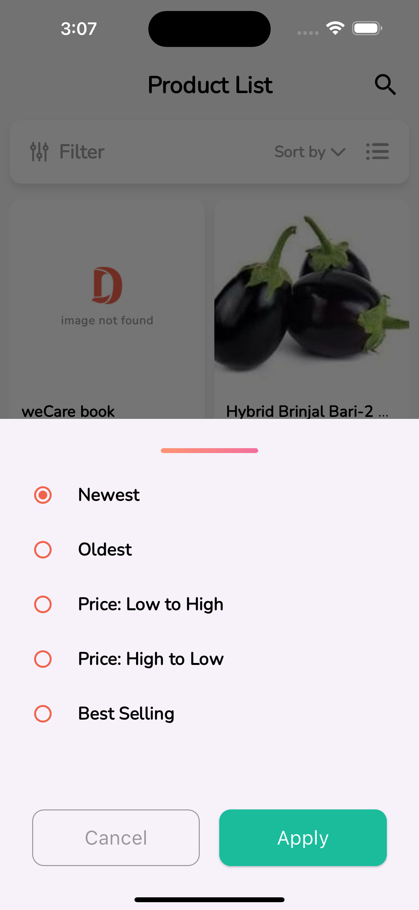
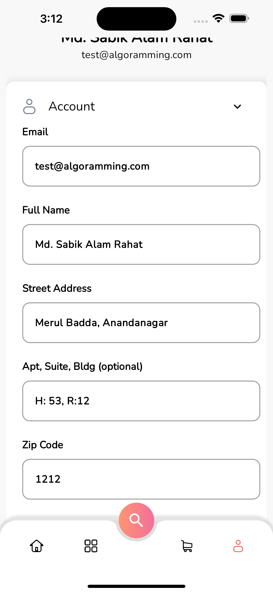

# Wedevs Ltd. Flutter Task

Developed a simple Flutter application that enables the user authenticate and view the list of products from the provided json. The user can also filter the product list by category and search by product name. The user can also change the app theme, language, date and time format, and font style. The user can also view the local database data and clear the local database data. The user can also view the app performance graph.

## UI Design

<table>
  <tr>
    <td></td>
    <td></td>
    <td></td>
  </tr>
  <tr>
    <td></td>
    <td></td>
    <td></td>
  </tr>
  <tr>
    <td></td>
    <td></td>
    <td></td>
  </tr>
  <tr>
    <td></td>
    <td></td>
    <td></td>
  </tr>
  <tr>
    <td></td>
    <td></td>
    <td></td>
  </tr>
 </table>

## Features
- Signup and signin with wp json
- User profile update.
- Show the list of product from the json data provided.
- Realtime data filtering.
- Show the network status.
- Show the loading indicator while fetching data from the API.
- Api error handling.
- Show the error message if the API fails to fetch data.
- Dark and light theme support.
- Change the language (English and Bengali).
- Change the Date and Time format.
- Change font style.
- View the local database data.
- Clear the local database data.
- Show the app performance graph.